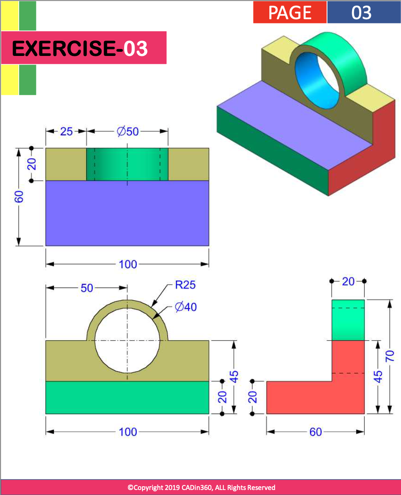
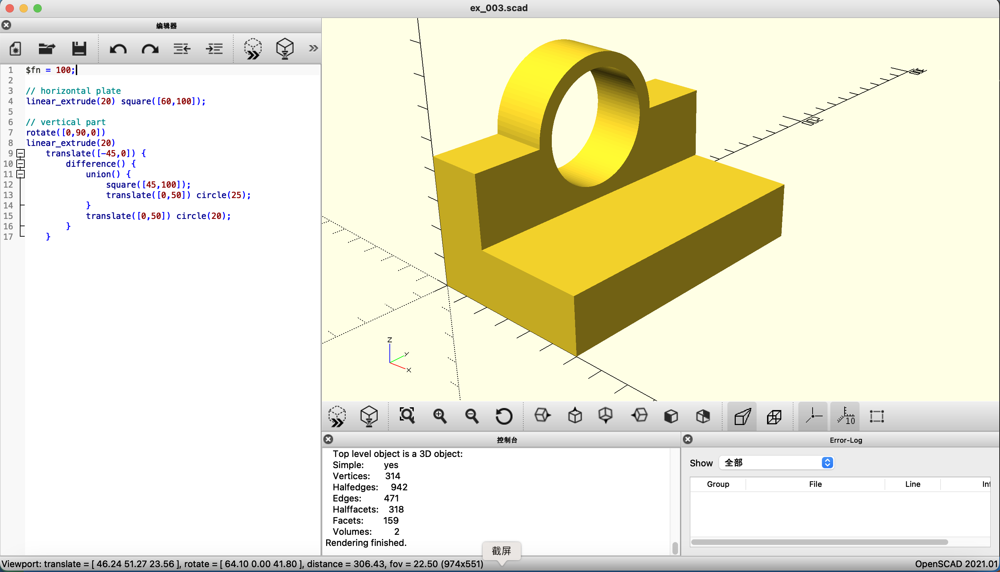

# Exercise 003 using OpenSCAD

## Source Question



Analysis:

- The plates themselves in this exercise is straight-forward, just use 2D `square` is enough
- Practice `union()` and `difference()` to make the vertical parts, pay attention on the sequence of using these two functions
- Once 2D shapes are ready, just `line_extrude` and then `rotate`

## Code

```openscad
$fn = 100;

// horizontal plate
linear_extrude(20) square([60,100]);

// vertical part
rotate([0,90,0])
linear_extrude(20) 
    translate([-45,0]) {
        difference() {
            union() {
                square([45,100]);
                translate([0,50]) circle(25);
            }
            translate([0,50]) circle(20);
        }
    }
```

## View in OpenSCAD



Date: 2022/12/03

Author: Xiaoqi Zhao