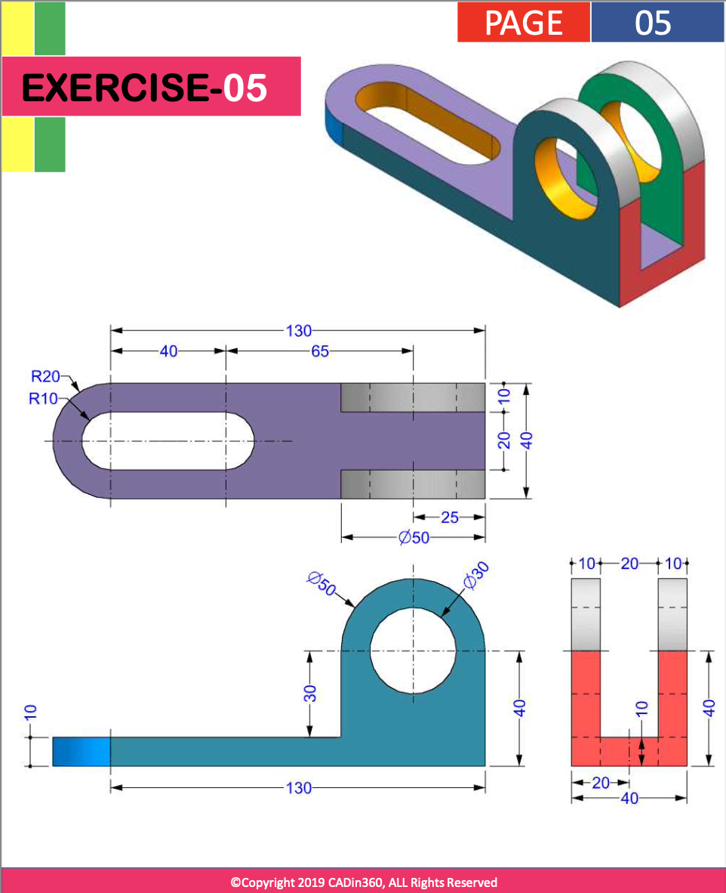
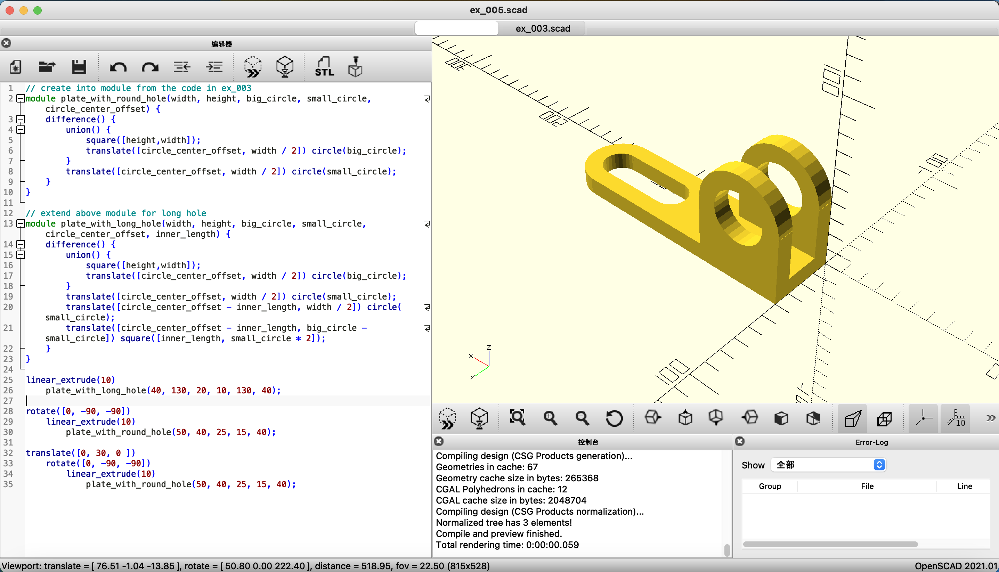

# Exercise 005 using OpenSCAD

## Source Question



Analysis:

- For every repeatable shapes, try to use Module

## Code

```openscad
// create into module from the code in ex_003
module plate_with_round_hole(width, height, big_circle, small_circle, circle_center_offset) {
    difference() {
        union() {
            square([height,width]);
            translate([circle_center_offset, width / 2]) circle(big_circle);
        }
        translate([circle_center_offset, width / 2]) circle(small_circle);
    }
}

// extend above module for long hole
module plate_with_long_hole(width, height, big_circle, small_circle, circle_center_offset, inner_length) {
    difference() {
        union() {
            square([height,width]);
            translate([circle_center_offset, width / 2]) circle(big_circle);
        }
        translate([circle_center_offset, width / 2]) circle(small_circle);
        translate([circle_center_offset - inner_length, width / 2]) circle(small_circle);
        translate([circle_center_offset - inner_length, big_circle - small_circle]) square([inner_length, small_circle * 2]);
    }
}

linear_extrude(10)
    plate_with_long_hole(40, 130, 20, 10, 130, 40);

rotate([0, -90, -90])
    linear_extrude(10)
        plate_with_round_hole(50, 40, 25, 15, 40);

translate([0, 30, 0 ])
    rotate([0, -90, -90])
        linear_extrude(10)
            plate_with_round_hole(50, 40, 25, 15, 40);
```

## View in OpenSCAD



Date: 2022/12/03

Author: Xiaoqi Zhao