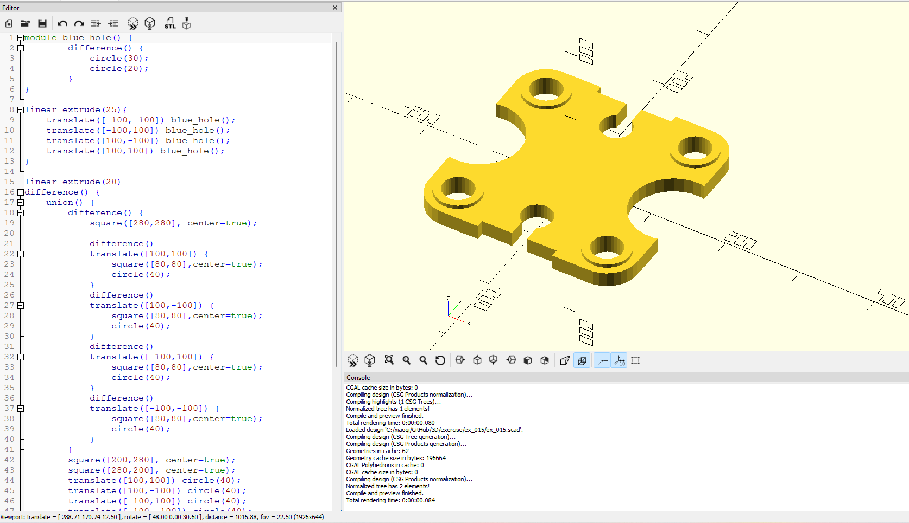

# Exercise 015 using OpenSCAD

## Source Question


Analysis:

[ ] need to find smarter way, this is meeting the target but too complex

## Code

```openscad
module blue_hole() {
        difference() {
            circle(30);
            circle(20);
        }
}

linear_extrude(25){
    translate([-100,-100]) blue_hole();
    translate([-100,100]) blue_hole();
    translate([100,-100]) blue_hole();
    translate([100,100]) blue_hole();
}

linear_extrude(20)
difference() {
    union() {
        difference() {
            square([280,280], center=true);
        
            difference()
            translate([100,100]) {
                square([80,80],center=true);
                circle(40);
            }
            difference()
            translate([100,-100]) {
                square([80,80],center=true);
                circle(40);
            }
            difference()
            translate([-100,100]) {
                square([80,80],center=true);
                circle(40);
            }
            difference()
            translate([-100,-100]) {
                square([80,80],center=true);
                circle(40);
            }
        }
        square([200,280], center=true);
        square([280,200], center=true);
        translate([100,100]) circle(40);
        translate([100,-100]) circle(40);
        translate([-100,100]) circle(40);
        translate([-100,-100]) circle(40);
    }
    
    translate([130,0]) circle(54);
    translate([-130,0]) circle(54);
    
    translate([0,90]) circle(20);
    translate([-10,100]) square([20,30]);
    translate([-50,130]) square([100,10]);
    
    translate([0,-90]) circle(20);
    translate([-10,-130]) square([20,30]);
    translate([-50,-140]) square([100,10]);
    
    translate([-100,-100]) circle(30);
    translate([-100,100]) circle(30);
    translate([100,-100]) circle(30);
    translate([100,100]) circle(30);
}
```

## View in OpenSCAD



Date: 2022/12/06

Author: Xiaoqi Zhao